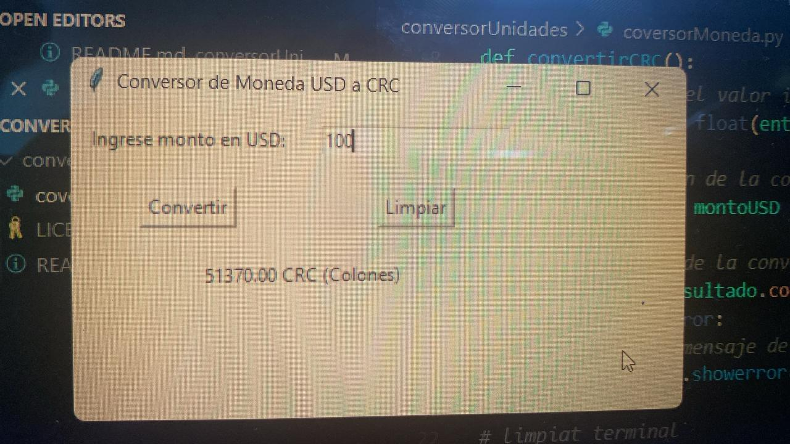
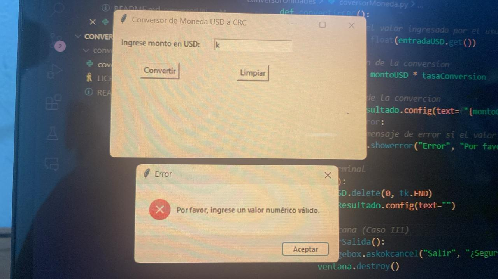
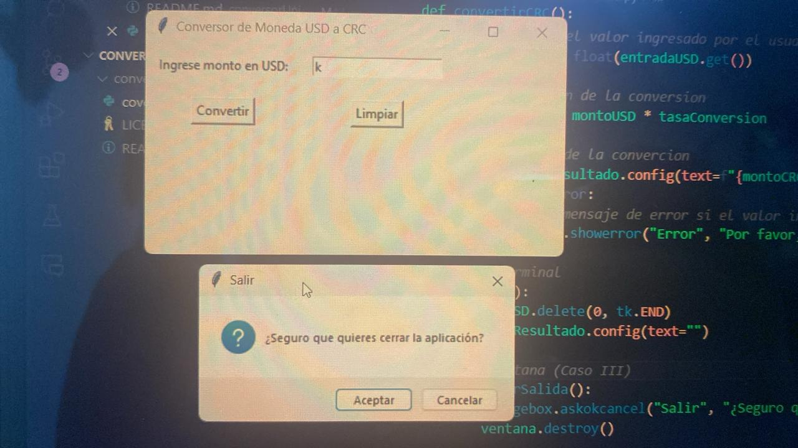

# Conversor de Moneda USD a CRC
### Aclaracion: la tasa de conversion usada es la del 18 de octubre del 2024, si desea obtimizar el proceso cammie la variable tasaConversion en el script al del dia correspondiente al uso del codigo

### Autor: **Marco Castillo**

## Instrucciones de uso:
1. Clona el repositorio en tu máquina local.
2. Navega al directorio `conversorUnidades`.
3. Ejecuta el script por medio de la terminal

## Implementacion del codigo
### El codigo contempla los siguientes casos:
1. Conversión regular con resultado esperado.

2. Valor inválido ingresado para la conversión con el mensaje de error.

3. Ventana emergente al cerrar la ventana.
